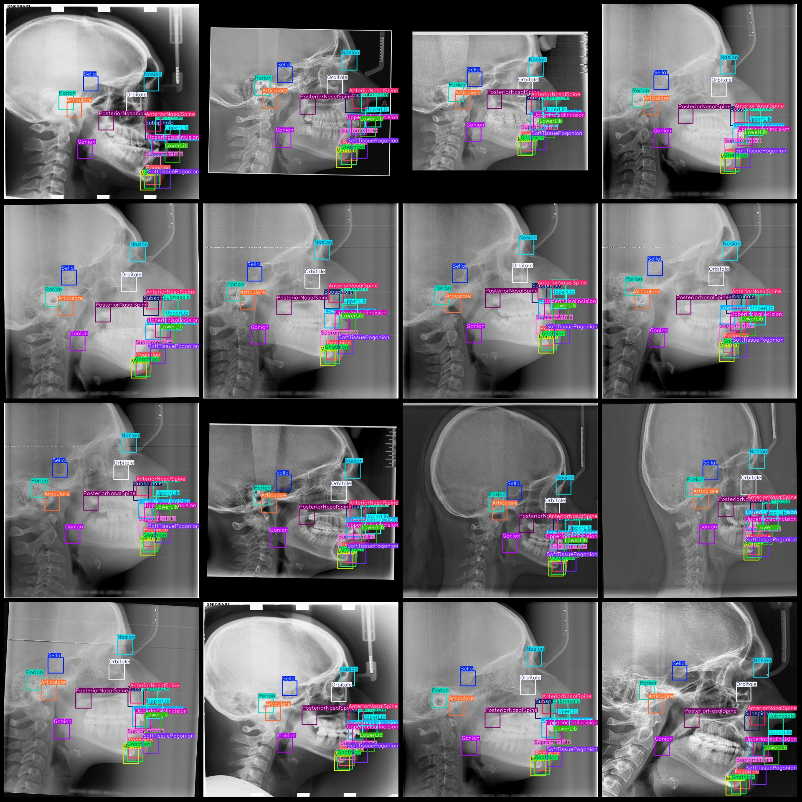
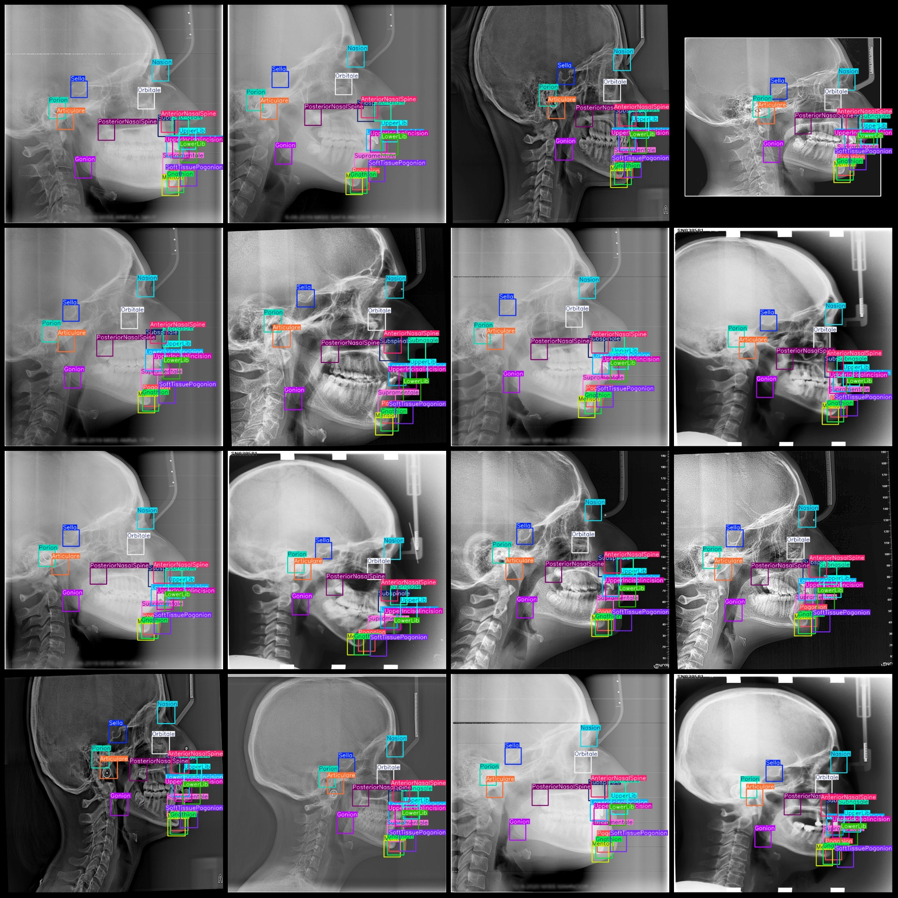

# Smart Health Head Lateral View Feature Point Detection Dataset VOC+YOLO Format with 1571 Images and 19 Categories

Dataset format: Pascal VOC format + YOLO format (txt files without split paths, containing only jpg images and corresponding VOC format xml files and yolo format txt files)
Number of images: 1571
Number of annotations: 1571
Number of annotation files: 1571
Number of annotation categories: 19
Annotation category names (Note that the order of categories in yolo format is not consistent with this, but refer to the labels folder's classes.txt): ["AnteriorNasalSpine", "Articulare", "Gnathion", "Gonion", "LowerIncisalincision", "LowerLib", "Menton", "Nasion", "Orbitale", "Pogonion", "Porion", "PosteriorNasalSpine", "Sella", "SoftTissuePogonion", "Subnasale", "Subspinale", "Supramentale", "UpperIncisalincision", "UpperLib"]
Number of boxes per category:
AnteriorNasalSpine (anterior nasal spine) = 1571
Articulare (joint point) = 1571
Gnathion (submandibular point) = 1570
Gonion (mandibular angle point) = 1571
LowerIncisalincision (lower central incisor gingival margin point) = 1571
LowerLib (lower lip point) = 1571
Menton (buccal point/buccal apex) = 1570
Nasion (nasal root point) = 1571
The orbital rim count is 1571.
The Frame Number of Pogonion (Basion Point) = 1571
Porion (Auricular Point) Frame Count = 1571
PosteriorNasalSpine (Posterodorsal Spine) Frame Count = 1571
The number of frames for Sella (Dorsum sellae) is 1571.
SoftTissuePogonion (soft tissue pogonion) frame number = 1571
The subnasale (subnasal point) count is 1571.
Subspinale (Superior Spinal Nerve Root) is located at the anterior point of the upper vertebral body, below the superior border of the foramen magnum.
Supramentale (P1571) is a skeletal landmark located on the chin. It is the uppermost point of the mandible, just above the angle of the jaw.
Upper Incisal Incision (upper central incisor gingival margin point) = 1571
The upperlib (upper lip point) frame number is 1571.
The total number of frames is 29847.
Number of images per category:
AnteriorNasalSpine refers to the nasal spine located at the front of the nose. It is a key structure in the anatomy of the human face and plays a significant role in facial expression, breathing, and overall facial aesthetics. The number 1571 associated with this term suggests that there are 1571 images or instances of AnteriorNasalSpine in a given dataset or collection. This information can be useful for researchers, physicians, and other healthcare professionals who require a comprehensive understanding of the subject matter.
Articulare occupies a total of 1571 images.
Gnathion (Buccal Point) occupies 1570 images.
Gonion (Mandibular Corner Point) occupies 1571 images.
LowerIncisalincision (Incisal Edge Point of Lower Incisors) occupies 1571 images.
Lower Limb (Lower Lip Point) occupies 1571 images.
Menton (Buccal Point/Buccal Apex) occupies 1570 images.
Nasion (Nose Base Point) occupies 1571 images.
Orbitale (Occipital Point) occupies 1571 images.
Pogonion (Buccal Anterior Point) occupies 1571 images.
Porion (Auricular Point) occupies 1571 images.
Posterior Nasal Spine (Posterior Nasal Process) occupies 1571 images.
Sella (Hypophysis Point) occupies 1571 images.
Soft Tissue Pogonion (Soft Tissue Buccal Anterior Point) occupies 1571 images.
Subnasale (Nasal Inferior Point) occupies 1571 images.
Subspinale (Anterior Nasal Septum/Inferior Nasal Spondyloid Point) occupies 1571 images.
Superior Mentale (Buccal Upper Point) occupies 1571 images.
UpperIncisalincision (upper incisor gingival margin) = 1571
UpperLib (Upper Lip Point) occupies a picture count of 1571.
Image resolution: 768x768
Use the labeling tool: labelImg.
Noun phrases and verb phrases should be separated by commas.
Important note: The dataset does not have been divided into training, validation, and test sets.
Special notice: This dataset does not guarantee the accuracy of the trained model or weight files.
Image Preview:
## Image

Here is a pay link on Stripe ( https://buy.stripe.com/3cs8yP7sY87d0vu9AB ). Please contact me lonlonago@foxmail.com after funding $89, and I will send you a complete data files , thank you!

